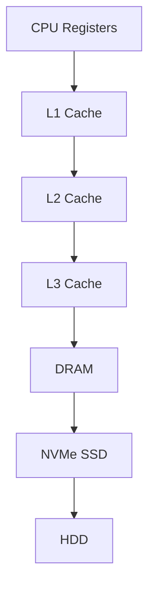
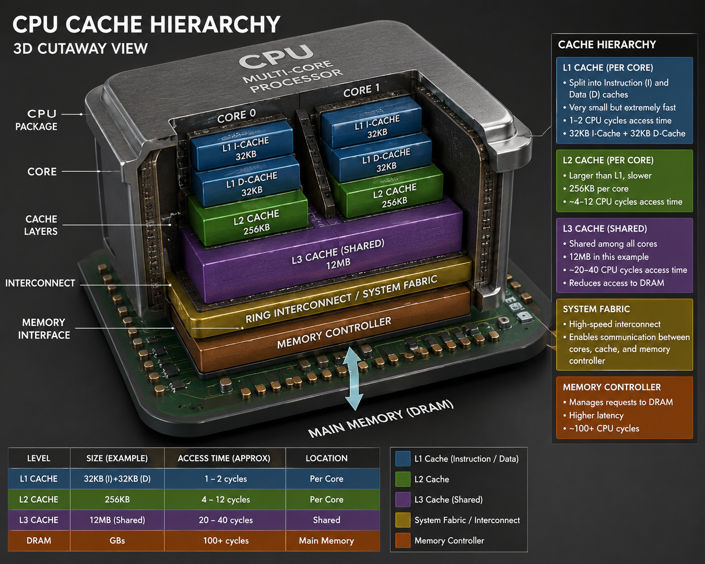
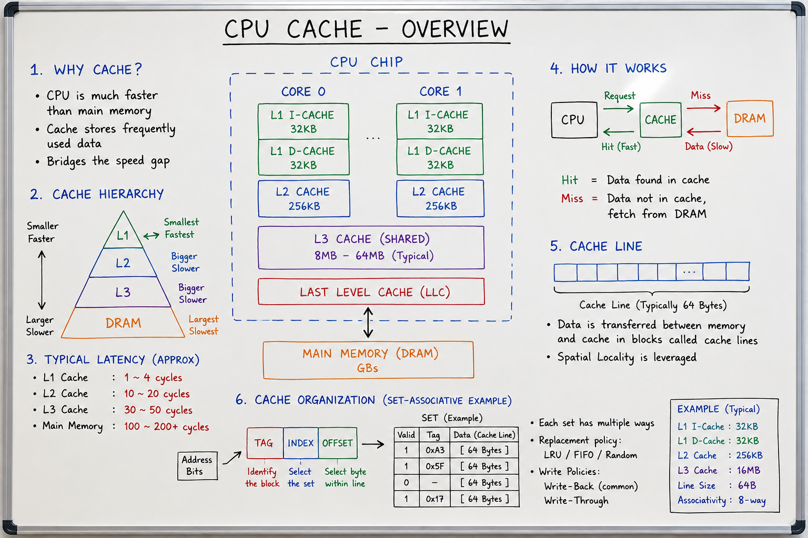

# CPU Cache Fundamentals: The Hidden Engine Behind Modern Computing

**Part 1 of the HPC, NUMA, PCIe, DMA, and RDMA Performance Series**

## Introduction

Modern processors can execute billions of instructions per second, yet they often spend a significant amount of time waiting for data.

Because CPU speed has increased much faster than memory speed, modern systems rely on CPU cache to bridge the gap.

Whether you are building:

- High-Performance Computing (HPC) applications
- Storage systems
- NVMe-over-Fabrics solutions
- Distributed databases
- AI/ML platforms
- RDMA-based systems

understanding CPU cache is essential for achieving maximum performance.

---

# The Memory Wall Problem

| Component | Typical Latency |
|------------|----------------|
| CPU Register | ~1 Cycle |
| L1 Cache | 1–4 Cycles |
| L2 Cache | 10–15 Cycles |
| L3 Cache | 30–60 Cycles |
| DRAM | 100–300 Cycles |
| NVMe SSD | Microseconds |
| HDD | Milliseconds |

Without cache, CPUs would spend most of their time waiting.

---

# Why CPU Cache Exists

CPU Cache acts as a high-speed buffer between the processor and main memory.

```text
CPU
 |
 v
Cache
 |
 v
DRAM
 |
 v
Storage
```

---

# Principle of Locality

## Temporal Locality

If a piece of data is accessed once, it is likely to be accessed again soon.

```c
for(int i=0;i<1000;i++)
{
    sum += a;
}
```

## Spatial Locality

If one memory location is accessed, nearby locations are likely to be accessed soon.

```c
for(int i=0;i<1000;i++)
{
    sum += arr[i];
}
```

---

# CPU Cache Hierarchy



---

# L1, L2 and L3 Cache

| Cache | Typical Size | Latency |
|---------|-------------|---------|
| L1 | 32KB–64KB | 1–4 cycles |
| L2 | 256KB–2MB | 10–15 cycles |
| L3 | 8MB–128MB+ | 30–60 cycles |

---

# Cache Lines

Cache transfers data in fixed-size blocks called cache lines.

Typical size:

```text
64 Bytes
```

---

# Cache Mapping Techniques

## Direct Mapping

One memory block maps to one cache location.

## Fully Associative

Any memory block can be stored anywhere.

## Set Associative

Most modern CPUs use N-way set associative caches.

---

# Cache Miss Types

## Cold Miss

First access to data.

## Capacity Miss

Working set exceeds cache size.

## Conflict Miss

Multiple memory blocks compete for the same cache location.

---

# Average Memory Access Time (AMAT)

```text
AMAT = Hit Time + (Miss Rate × Miss Penalty)
```

Example:

```text
Hit Time = 2 ns
Miss Rate = 5%
Miss Penalty = 100 ns

AMAT = 7 ns
```

---

# Cache Hit Ratio

```text
Hit Ratio = Hits / Total Accesses
```

Higher hit ratio means better cache efficiency.

---

# Real-World Storage Example

```text
NVMe SSD
   |
   v
 DMA
   |
   v
 DRAM
   |
   v
CPU Cache
   |
   v
Application
```

Cache misses directly affect latency and IOPS.

---

# Optimization Tips

- Prefer sequential memory access
- Improve temporal locality
- Improve spatial locality
- Align structures to cache lines
- Reduce cache misses
- Keep frequently accessed data together

Example:

```c
__attribute__((aligned(64)))
```

---

# Key Takeaways

- CPU Cache bridges the speed gap between CPU and memory.
- Locality is the foundation of caching.
- Cache hierarchy consists of L1, L2, and L3.
- Cache lines are typically 64 bytes.
- Cache misses significantly impact performance.
- AMAT is the most important cache performance metric.

---

# CPU Cache 3D



---

# CPU Cache White Board



---

# Next Article

## NUMA Fundamentals for Storage Engineers

Topics:

- NUMA Architecture
- Local vs Remote Memory Access
- NUMA-aware Design
- NUMA and NVMe Performance
- NUMA Optimization using numactl
- NUMA in HPC and RDMA Systems

## Tags

CPU Architecture, Systems Programming, Storage Systems, Performance Engineering, HPC
